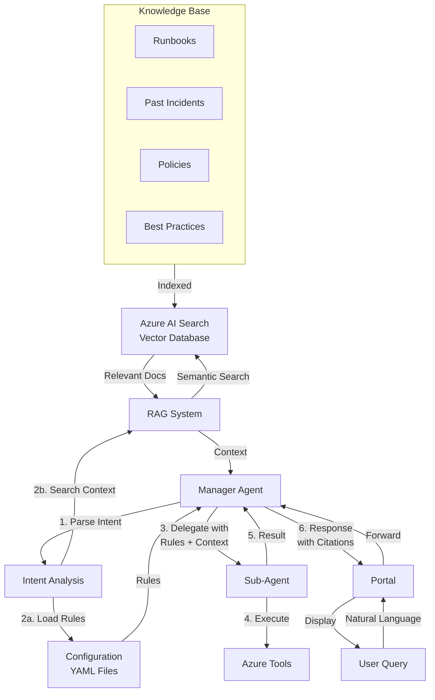
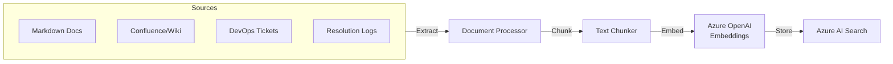
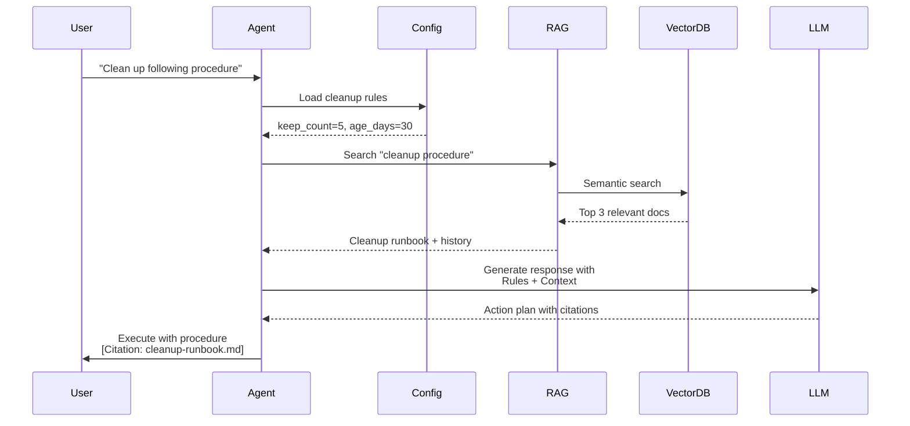

# RAG Integration Guide - Phase 3

**Status:** Future Enhancement  
**Prerequisites:** Complete Phase 1 (Configuration System) and Phase 2 (Multi-Agent System)  
**Estimated Timeline:** 4-6 weeks  
**Complexity:** Advanced

---

## Table of Contents

1. [Overview](#overview)
2. [When to Add RAG](#when-to-add-rag)
3. [Architecture](#architecture)
4. [Knowledge Base Sources](#knowledge-base-sources)
5. [Implementation Steps](#implementation-steps)
6. [Code Examples](#code-examples)
7. [Azure Services](#azure-services)
8. [Cost Considerations](#cost-considerations)
9. [Best Practices](#best-practices)

---

## Overview

### What is RAG (Retrieval-Augmented Generation)?

RAG enhances your agents by:
- **Retrieving** relevant knowledge from a vector database based on user queries
- **Augmenting** agent prompts with this contextual information
- **Generating** responses that incorporate both configuration rules AND organizational knowledge

### Configuration vs RAG

| Aspect | Configuration (Phase 1) | RAG (Phase 3) |
|--------|------------------------|---------------|
| **Data Type** | Structured (YAML, JSON) | Unstructured (documents, text) |
| **Use Case** | Rules, thresholds, patterns | Procedures, history, best practices |
| **Example** | "Keep 5 latest blobs" | "How did we resolve similar build failures?" |
| **Access Pattern** | Direct key lookup | Semantic search |
| **Update Frequency** | Rarely (deployment required) | Dynamic (add documents anytime) |
| **Storage** | Files or Azure App Config | Vector database (Azure AI Search) |

### Why Combine Both?

```
User: "Clean up old resources following our standard procedure"

┌─────────────────────────────────────────────────────────────┐
│ Agent Processing                                             │
├─────────────────────────────────────────────────────────────┤
│                                                              │
│ 1. Configuration Provides:                                  │
│    ✓ Keep 5 latest versions                                 │
│    ✓ Delete if older than 30 days                           │
│    ✓ VM pattern: vhds-ci-wat-template-*                     │
│                                                              │
│ 2. RAG Provides:                                             │
│    ✓ Cleanup runbook steps                                  │
│    ✓ Notification requirements                              │
│    ✓ Rollback procedures                                    │
│    ✓ Past incident learnings                                │
│                                                              │
│ 3. Combined Result:                                          │
│    → Execute with correct parameters (config)               │
│    → Follow organizational procedures (RAG)                 │
│    → Include lessons learned (RAG)                          │
└─────────────────────────────────────────────────────────────┘
```

---

## When to Add RAG

### Triggers to Consider RAG

Add RAG when you experience these scenarios:

#### 1. Complex Decision-Making
- Agents need context to make nuanced decisions
- Example: "Should I clean up this resource?" needs to consider:
  - Configuration: age threshold
  - RAG: "Is there an active deployment?" "Are there dependencies?"

#### 2. Repeated Questions About Procedures
- Users frequently ask "how do I..." questions
- Example: "How do we handle failed deployments?"
- RAG retrieves relevant runbooks automatically

#### 3. Historical Context Needed
- Decisions benefit from past experiences
- Example: "This build failed with error X"
- RAG retrieves: "Similar error occurred last month, resolved by Y"

#### 4. Compliance and Audit Requirements
- Need to cite organizational policies
- RAG can retrieve and reference specific policies
- Provides audit trail with citations

#### 5. Knowledge Consolidation
- DevOps knowledge scattered across docs, wikis, tickets
- RAG provides single source of truth
- Reduces tribal knowledge dependency

### Signs You're NOT Ready for RAG Yet

- Simple, well-defined tasks only
- Configuration covers all needs
- Small team with shared knowledge
- Limited documentation to index

**Recommendation:** Master Phase 1 (Configuration) and Phase 2 (Multi-Agent) first. RAG is powerful but adds complexity.

---

## Architecture

### High-Level RAG Architecture



### Component Details

#### 1. Knowledge Ingestion Pipeline



#### 2. Query-Time RAG Flow



---

## Knowledge Base Sources

### Recommended Content to Index

#### 1. Runbooks and Procedures

**Location:** `knowledge/runbooks/`

```markdown
# VM Cleanup Procedure

## Prerequisites
- Ensure no active deployments
- Check for dependencies
- Notify team in #devops channel

## Steps
1. Identify VMs older than threshold
2. Verify no active connections
3. Take final snapshot for 7 days
4. Execute deletion
5. Update inventory spreadsheet

## Rollback
If issues occur, restore from snapshot...
```

#### 2. Past Incident Resolutions

**Location:** `knowledge/incidents/`

```markdown
# Incident: Build Failure - OutOfMemoryError (2026-01-15)

## Problem
CI builds failing with OutOfMemoryError in npm install step.

## Root Cause
Node.js default heap size insufficient for large dependency tree.

## Resolution
Added `--max-old-space-size=4096` to npm command.

## Prevention
Updated all build agents with increased memory allocation.
```

#### 3. Best Practices

**Location:** `knowledge/best-practices/`

```markdown
# Azure Resource Tagging Best Practices

## Required Tags
- Environment: dev/staging/prod
- CostCenter: department code
- Owner: team email

## Cleanup Tags
- permanent: prevents auto-cleanup
- expiry-date: YYYY-MM-DD format
```

#### 4. Azure DevOps Policies

**Location:** `knowledge/policies/`

```markdown
# Resource Retention Policy

## Storage Blobs
- Build artifacts: 90 days
- Test results: 45 days
- Production backups: 1 year

## Virtual Machines
- CI templates: 30 days
- Staging: 60 days
- Production: manual approval required
```

### Knowledge Organization Structure

```
mulagent/
├── knowledge/
│   ├── runbooks/
│   │   ├── vm-cleanup-procedure.md
│   │   ├── blob-cleanup-procedure.md
│   │   ├── deployment-rollback.md
│   │   └── incident-response.md
│   ├── incidents/
│   │   ├── 2026-01-15-build-memory-error.md
│   │   ├── 2026-01-20-storage-quota-exceeded.md
│   │   └── 2026-02-01-vm-network-failure.md
│   ├── best-practices/
│   │   ├── azure-tagging.md
│   │   ├── naming-conventions.md
│   │   ├── security-guidelines.md
│   │   └── cost-optimization.md
│   └── policies/
│       ├── retention-policy.md
│       ├── approval-workflows.md
│       └── compliance-requirements.md
```

---

## Implementation Steps

### Step 1: Set Up Azure AI Search (Week 1)

#### Create Azure AI Search Resource

```bash
# Using Azure CLI
az search service create \
  --name devops-knowledge-search \
  --resource-group rg-devops-agents \
  --sku basic \
  --location eastus
```

#### Create Search Index with Vector Support

```python
# create_search_index.py
from azure.search.documents.indexes import SearchIndexClient
from azure.search.documents.indexes.models import (
    SearchIndex,
    SimpleField,
    SearchableField,
    SearchField,
    VectorSearch,
    VectorSearchProfile,
    HnswAlgorithmConfiguration
)
from azure.core.credentials import AzureKeyCredential

endpoint = "https://devops-knowledge-search.search.windows.net"
api_key = os.getenv("AZURE_SEARCH_API_KEY")

client = SearchIndexClient(endpoint, AzureKeyCredential(api_key))

# Define index schema
fields = [
    SimpleField(name="id", type="Edm.String", key=True),
    SearchableField(name="title", type="Edm.String"),
    SearchableField(name="content", type="Edm.String"),
    SimpleField(name="category", type="Edm.String", filterable=True),
    SimpleField(name="source_file", type="Edm.String"),
    SimpleField(name="last_updated", type="Edm.DateTimeOffset"),
    SearchField(
        name="content_vector",
        type="Collection(Edm.Single)",
        searchable=True,
        vector_search_dimensions=1536,  # Ada-002 dimensions
        vector_search_profile_name="vector-profile"
    )
]

# Configure vector search
vector_search = VectorSearch(
    profiles=[
        VectorSearchProfile(
            name="vector-profile",
            algorithm_configuration_name="hnsw-config"
        )
    ],
    algorithms=[
        HnswAlgorithmConfiguration(name="hnsw-config")
    ]
)

# Create index
index = SearchIndex(
    name="devops-knowledge",
    fields=fields,
    vector_search=vector_search
)

client.create_or_update_index(index)
print("Search index created successfully")
```

### Step 2: Index Knowledge Base (Week 1-2)

#### Document Processor

```python
# src/rag/document_processor.py
"""
Document processor for knowledge base indexing.
"""

import os
from pathlib import Path
from typing import List, Dict, Any
import hashlib
from datetime import datetime

from azure.search.documents import SearchClient
from azure.core.credentials import AzureKeyCredential
import openai


class DocumentProcessor:
    """Process and index documents into Azure AI Search"""
    
    def __init__(self):
        self.search_client = SearchClient(
            endpoint=os.getenv("AZURE_SEARCH_ENDPOINT"),
            index_name="devops-knowledge",
            credential=AzureKeyCredential(os.getenv("AZURE_SEARCH_API_KEY"))
        )
        
        # Configure Azure OpenAI for embeddings
        openai.api_type = "azure"
        openai.api_key = os.getenv("AZURE_OPENAI_KEY")
        openai.api_base = os.getenv("AZURE_OPENAI_ENDPOINT")
        openai.api_version = "2024-02-01"
    
    def chunk_document(self, content: str, chunk_size: int = 1000, overlap: int = 200) -> List[str]:
        """
        Split document into overlapping chunks.
        
        Args:
            content: Document content
            chunk_size: Maximum chunk size in characters
            overlap: Overlap between chunks
        
        Returns:
            List of text chunks
        """
        chunks = []
        start = 0
        
        while start < len(content):
            end = start + chunk_size
            chunk = content[start:end]
            chunks.append(chunk)
            start = end - overlap
        
        return chunks
    
    def get_embedding(self, text: str) -> List[float]:
        """
        Get embedding vector for text using Azure OpenAI.
        
        Args:
            text: Text to embed
        
        Returns:
            Embedding vector
        """
        response = openai.Embedding.create(
            input=text,
            engine="text-embedding-ada-002"
        )
        return response['data'][0]['embedding']
    
    def process_markdown_file(self, file_path: Path, category: str) -> List[Dict[str, Any]]:
        """
        Process a markdown file and prepare for indexing.
        
        Args:
            file_path: Path to markdown file
            category: Category (runbooks, incidents, etc.)
        
        Returns:
            List of documents ready for indexing
        """
        with open(file_path, 'r', encoding='utf-8') as f:
            content = f.read()
        
        # Extract title (first # heading)
        lines = content.split('\n')
        title = "Untitled"
        for line in lines:
            if line.startswith('# '):
                title = line[2:].strip()
                break
        
        # Chunk the content
        chunks = self.chunk_document(content)
        
        # Create document for each chunk
        documents = []
        for i, chunk in enumerate(chunks):
            # Generate unique ID
            doc_id = hashlib.md5(
                f"{file_path.name}-{i}".encode()
            ).hexdigest()
            
            # Get embedding
            embedding = self.get_embedding(chunk)
            
            doc = {
                "id": doc_id,
                "title": f"{title} (Part {i+1})" if len(chunks) > 1 else title,
                "content": chunk,
                "category": category,
                "source_file": str(file_path),
                "last_updated": datetime.now().isoformat(),
                "content_vector": embedding
            }
            documents.append(doc)
        
        return documents
    
    def index_knowledge_base(self, knowledge_dir: Path):
        """
        Index entire knowledge base directory.
        
        Args:
            knowledge_dir: Path to knowledge directory
        """
        categories = {
            "runbooks": knowledge_dir / "runbooks",
            "incidents": knowledge_dir / "incidents",
            "best-practices": knowledge_dir / "best-practices",
            "policies": knowledge_dir / "policies"
        }
        
        all_documents = []
        
        for category, category_dir in categories.items():
            if not category_dir.exists():
                print(f"Skipping {category} - directory not found")
                continue
            
            print(f"Processing {category}...")
            
            # Process all markdown files in category
            for md_file in category_dir.glob("*.md"):
                print(f"  - {md_file.name}")
                documents = self.process_markdown_file(md_file, category)
                all_documents.extend(documents)
        
        # Upload to Azure AI Search
        print(f"\nUploading {len(all_documents)} documents to Azure AI Search...")
        result = self.search_client.upload_documents(documents=all_documents)
        print(f"Indexed {len(result)} documents successfully")


# CLI for indexing
if __name__ == "__main__":
    import argparse
    
    parser = argparse.ArgumentParser(description="Index knowledge base")
    parser.add_argument(
        "--knowledge-dir",
        type=str,
        default="knowledge",
        help="Path to knowledge directory"
    )
    args = parser.parse_args()
    
    processor = DocumentProcessor()
    processor.index_knowledge_base(Path(args.knowledge_dir))
```

### Step 3: Implement RAG Retrieval (Week 2-3)

```python
# src/rag/retrieval.py
"""
RAG retrieval system for knowledge base queries.
"""

import os
from typing import List, Dict, Any, Optional
from azure.search.documents import SearchClient
from azure.core.credentials import AzureKeyCredential
import openai


class KnowledgeRetriever:
    """Retrieve relevant knowledge from vector database"""
    
    def __init__(self):
        self.search_client = SearchClient(
            endpoint=os.getenv("AZURE_SEARCH_ENDPOINT"),
            index_name="devops-knowledge",
            credential=AzureKeyCredential(os.getenv("AZURE_SEARCH_API_KEY"))
        )
        
        # Configure Azure OpenAI for embeddings
        openai.api_type = "azure"
        openai.api_key = os.getenv("AZURE_OPENAI_KEY")
        openai.api_base = os.getenv("AZURE_OPENAI_ENDPOINT")
        openai.api_version = "2024-02-01"
    
    def get_embedding(self, text: str) -> List[float]:
        """Get embedding for search query"""
        response = openai.Embedding.create(
            input=text,
            engine="text-embedding-ada-002"
        )
        return response['data'][0]['embedding']
    
    def search(
        self,
        query: str,
        top_k: int = 3,
        category_filter: Optional[str] = None
    ) -> List[Dict[str, Any]]:
        """
        Semantic search in knowledge base.
        
        Args:
            query: Search query
            top_k: Number of results to return
            category_filter: Optional category filter
        
        Returns:
            List of relevant documents with metadata
        """
        # Get query embedding
        query_vector = self.get_embedding(query)
        
        # Build filter if category specified
        filter_expression = None
        if category_filter:
            filter_expression = f"category eq '{category_filter}'"
        
        # Perform vector search
        results = self.search_client.search(
            search_text=None,  # Pure vector search
            vector_queries=[{
                "vector": query_vector,
                "k_nearest_neighbors": top_k,
                "fields": "content_vector"
            }],
            filter=filter_expression,
            select=["title", "content", "category", "source_file", "last_updated"],
            top=top_k
        )
        
        # Format results
        documents = []
        for result in results:
            documents.append({
                "title": result["title"],
                "content": result["content"],
                "category": result["category"],
                "source": result["source_file"],
                "score": result.get("@search.score", 0),
                "last_updated": result["last_updated"]
            })
        
        return documents
    
    def search_by_category(self, query: str, category: str, top_k: int = 3) -> List[Dict[str, Any]]:
        """Search within specific category"""
        return self.search(query, top_k=top_k, category_filter=category)


# Example usage
if __name__ == "__main__":
    retriever = KnowledgeRetriever()
    
    # Example queries
    queries = [
        "How do we clean up old VMs?",
        "What to do when build fails with memory error?",
        "Azure resource tagging best practices"
    ]
    
    for query in queries:
        print(f"\nQuery: {query}")
        print("=" * 60)
        
        results = retriever.search(query, top_k=2)
        
        for i, doc in enumerate(results, 1):
            print(f"\n{i}. {doc['title']} [{doc['category']}]")
            print(f"   Source: {doc['source']}")
            print(f"   Score: {doc['score']:.3f}")
            print(f"   Content: {doc['content'][:200]}...")
```

### Step 4: Integrate RAG with Agents (Week 3-4)

```python
# src/agents/rag_enabled_agent.py
"""
RAG-enabled agent that combines configuration with knowledge retrieval.
"""

import sys
from pathlib import Path
sys.path.append(str(Path(__file__).parent.parent))

from config_loader import config_loader
from rag.retrieval import KnowledgeRetriever
import yaml


class RAGEnabledAgent:
    """
    Agent enhanced with RAG capabilities.
    
    Combines:
    - Configuration rules (structured)
    - Knowledge base context (unstructured)
    """
    
    def __init__(self, agent_name: str):
        self.agent_name = agent_name
        self.config_loader = config_loader
        self.retriever = KnowledgeRetriever()
    
    def build_context(self, user_query: str, config_name: str) -> str:
        """
        Build enhanced context combining config and RAG.
        
        Args:
            user_query: User's natural language query
            config_name: Configuration file to load
        
        Returns:
            Enhanced context string for agent prompt
        """
        # 1. Load configuration rules
        config = self.config_loader.load_config(config_name)
        config_str = yaml.dump(config, default_flow_style=False)
        
        # 2. Retrieve relevant knowledge
        knowledge_docs = self.retriever.search(user_query, top_k=3)
        
        # 3. Format knowledge with citations
        knowledge_str = ""
        for i, doc in enumerate(knowledge_docs, 1):
            knowledge_str += f"\n### Document {i}: {doc['title']}\n"
            knowledge_str += f"Source: {doc['source']}\n"
            knowledge_str += f"Category: {doc['category']}\n"
            knowledge_str += f"\n{doc['content']}\n"
            knowledge_str += "-" * 60 + "\n"
        
        # 4. Combine into enhanced context
        enhanced_context = f"""
# CONFIGURATION RULES
The following configuration rules MUST be followed:

```yaml
{config_str}
```

# RELEVANT KNOWLEDGE BASE
The following documents from the knowledge base may provide helpful context:

{knowledge_str}

# INSTRUCTIONS
1. Use the CONFIGURATION RULES for specific thresholds, patterns, and policies
2. Use the KNOWLEDGE BASE for procedures, best practices, and historical context
3. If there's a conflict, CONFIGURATION RULES take precedence
4. When providing answers, cite the knowledge base documents used
5. If you reference a procedure, mention the source document
"""
        return enhanced_context
    
    def execute_with_rag(self, user_query: str, config_name: str) -> Dict[str, Any]:
        """
        Execute query with RAG enhancement.
        
        Args:
            user_query: User query
            config_name: Config file to use
        
        Returns:
            Execution result with citations
        """
        # Build enhanced context
        context = self.build_context(user_query, config_name)
        
        # In real implementation, this would call the LLM with enhanced context
        # For now, return the context for demonstration
        return {
            "query": user_query,
            "context": context,
            "agent": self.agent_name
        }


# Example: Azure Resource Agent with RAG
class RAGAzureResourceAgent(RAGEnabledAgent):
    """Azure Resource Agent enhanced with RAG"""
    
    def __init__(self):
        super().__init__("RAGAzureResourceAgent")
    
    def cleanup_with_rag(self, user_query: str) -> Dict[str, Any]:
        """
        Execute VM cleanup with RAG context.
        
        Example query: "Clean up old CI templates following our standard procedure"
        """
        # Get enhanced context
        context = self.build_context(user_query, "azure_resources")
        
        print("=" * 70)
        print("ENHANCED AGENT CONTEXT")
        print("=" * 70)
        print(context)
        print("=" * 70)
        
        # In real implementation:
        # 1. Pass context to LLM (Azure OpenAI)
        # 2. LLM uses config for parameters AND knowledge for procedure
        # 3. Execute with both structured rules and contextual understanding
        # 4. Return result with citations
        
        return {
            "success": True,
            "query": user_query,
            "config_used": "azure_resources.yaml",
            "knowledge_sources": [
                "vm-cleanup-procedure.md",
                "azure-tagging.md"
            ],
            "message": "Cleanup executed following documented procedure with config parameters"
        }


# Example usage
if __name__ == "__main__":
    agent = RAGAzureResourceAgent()
    
    result = agent.cleanup_with_rag(
        "Clean up old CI template VMs following our standard procedure"
    )
    
    print("\n\nRESULT:")
    print(result)
```

---

## Azure Services

### Required Azure Resources

1. **Azure AI Search**
   - SKU: Basic or Standard
   - Features: Vector search enabled
   - Cost: ~$75-250/month depending on SKU

2. **Azure OpenAI**
   - Model: text-embedding-ada-002 (embeddings)
   - Model: gpt-4 or gpt-35-turbo (generation)
   - Cost: Pay per token

3. **Azure Storage** (optional)
   - For knowledge base backup
   - Cost: ~$20/month

### Infrastructure as Code

```bicep
// rag-infrastructure.bicep
param location string = 'eastus'
param searchServiceName string = 'devops-knowledge-search'

resource searchService 'Microsoft.Search/searchServices@2023-11-01' = {
  name: searchServiceName
  location: location
  sku: {
    name: 'basic'
  }
  properties: {
    replicaCount: 1
    partitionCount: 1
    hostingMode: 'default'
  }
}

output searchEndpoint string = 'https://${searchService.name}.search.windows.net'
output searchName string = searchService.name
```

---

## Cost Considerations

### Monthly Cost Estimate

| Component | Usage | Cost |
|-----------|-------|------|
| **Azure AI Search (Basic)** | 24/7 | $75 |
| **Embeddings (Ada-002)** | 1M tokens/month | $1 |
| **LLM Calls (GPT-4)** | Existing usage | $0 (incremental) |
| **Storage** | Knowledge base | $5 |
| **Total** | | **~$81/month** |

### Cost Optimization

1. **Use Basic tier initially** - Upgrade to Standard only if needed
2. **Cache embeddings** - Don't re-embed unchanged documents
3. **Limit RAG retrieval** - Use only when needed (not for simple config lookups)
4. **Batch indexing** - Index documents in batches, not individually

---

## Best Practices

### 1. Knowledge Base Maintenance

- **Update regularly** - Keep knowledge base current
- **Version control** - Store knowledge files in Git
- **Review process** - Verify information accuracy before indexing
- **Deprecate old content** - Remove outdated procedures

### 2. Chunking Strategy

- **Size:** 1000-1500 characters per chunk
- **Overlap:** 200-300 characters
- **Preserve context:** Don't split mid-sentence
- **Include headers:** Maintain markdown structure

### 3. Retrieval Tuning

- **Start with top_k=3** - Balance relevance vs token cost
- **Use filters** - Category filters for focused searches
- **Monitor relevance** - Track search quality metrics
- **Iterate on queries** - Refine query formulation

### 4. Agent Integration

- **Config first** - Check configuration before RAG
- **Cite sources** - Always reference knowledge base documents
- **Handle conflicts** - Config rules override knowledge base
- **Graceful degradation** - Work without RAG if unavailable

### 5. Security

- **Access control** - Restrict knowledge base updates
- **Sensitive data** - Don't index secrets or credentials
- **Audit trail** - Log all RAG retrievals
- **Rate limiting** - Prevent abuse of search endpoint

---

## Comparison: With vs Without RAG

### Example: VM Cleanup Task

#### Without RAG (Configuration Only)

```
User: "Clean up old VMs"

Agent thinks:
✓ Config says: keep 5 latest, age > 30 days
✓ Pattern: vhds-ci-wat-template-*
✓ Execute deletion

Result: ✓ VMs deleted per config
        ✗ No procedure followed
        ✗ No notifications sent
        ✗ No snapshot taken
```

#### With RAG (Configuration + Knowledge)

```
User: "Clean up old VMs following our procedure"

Agent thinks:
✓ Config says: keep 5 latest, age > 30 days
✓ RAG retrieves: vm-cleanup-procedure.md
  - Check for active deployments first
  - Take snapshots before deletion
  - Notify team in #devops channel
  - Update inventory

Result: ✓ VMs deleted per config
        ✓ Procedure followed
        ✓ Team notified
        ✓ Snapshots taken
        ✓ Documented properly
```

---

## Next Steps

### Ready to Implement RAG?

**Checklist:**

- [ ] Phase 1 (Configuration) completed and stable
- [ ] Phase 2 (Multi-Agent) working in production
- [ ] Knowledge base content prepared (20+ documents)
- [ ] Azure AI Search resource provisioned
- [ ] Embeddings model (Ada-002) available
- [ ] Team trained on knowledge base maintenance

**Implementation Timeline:**

- Week 1: Set up Azure AI Search and create index
- Week 2: Implement document processor and index knowledge base
- Week 3: Build retrieval system and test queries
- Week 4: Integrate RAG with agents
- Week 5-6: Testing, tuning, and production rollout

### Questions?

**Common Questions:**

Q: Can I use RAG without Azure AI Search?  
A: Yes, alternatives include Pinecone, Weaviate, or Qdrant. Azure AI Search is recommended for Azure-native integration.

Q: How much knowledge content do I need?  
A: Start with 20-50 documents. Quality over quantity.

Q: Will RAG slow down my agents?  
A: Adds ~500-1000ms latency per query. Use caching and only retrieve when needed.

Q: Can I combine RAG with Azure App Configuration?  
A: Yes! Use App Configuration for runtime config, RAG for knowledge retrieval.

---

**Document End** - Ready for Phase 3 RAG Implementation
