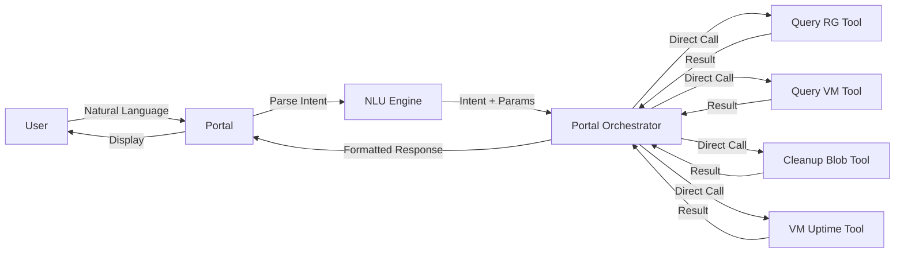
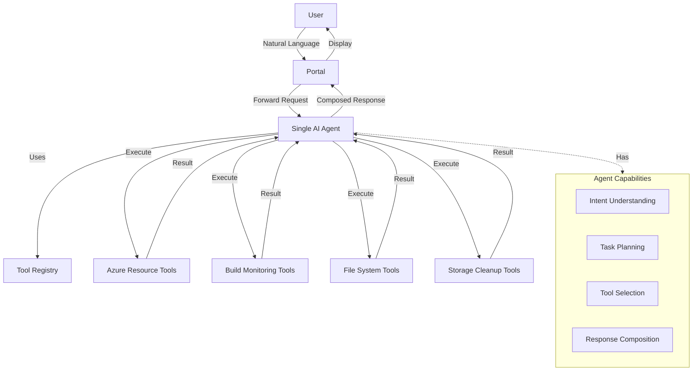
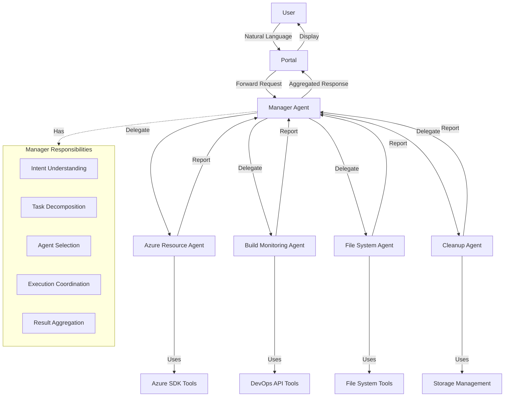
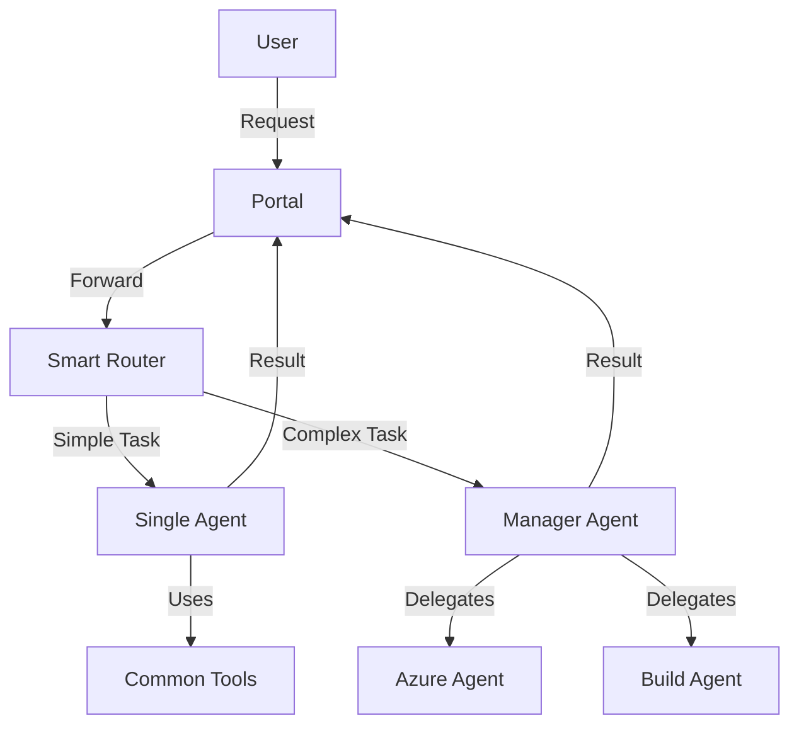
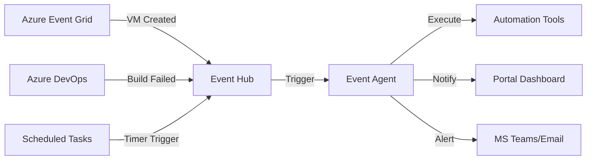
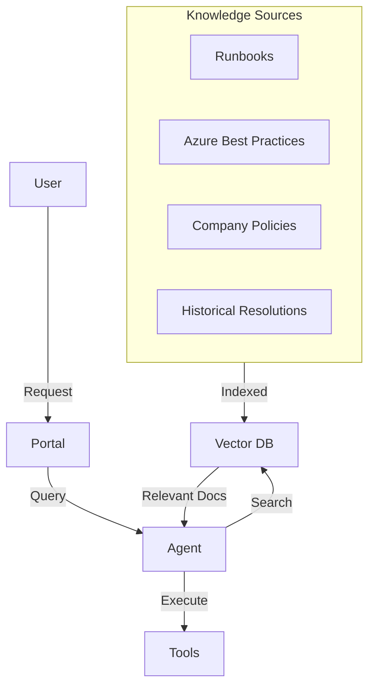
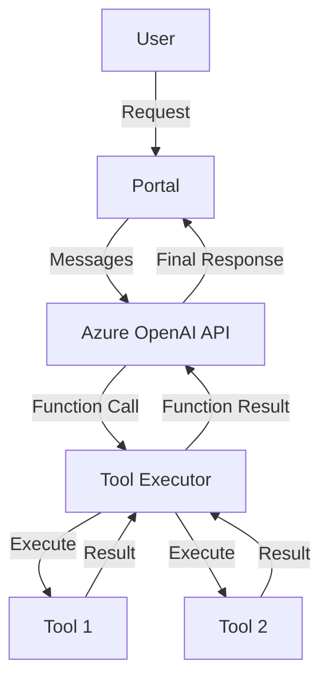

# AI Agent Strategy Analysis for Azure DevOps Automation

**Document Version:** 1.0  
**Date:** February 18, 2026  
**Purpose:** Evaluate architectural strategies for integrating AI-driven multi-agent systems into an existing internal portal for DevOps and Azure automation tasks.

---

## Executive Summary

This document analyzes different architectural approaches for implementing an AI-driven automation system that accepts natural language commands and performs DevOps and Azure operations. After evaluating three proposed strategies and exploring alternatives, we recommend a **Hybrid Approach** that combines the simplicity of a single agent for straightforward tasks with the power of specialized sub-agents for complex operations.

**Key Recommendation:** Start with Strategy 2 (Single Agent with Multiple Tools) and evolve to Strategy 3 (Manager + Sub-Agents) as complexity grows.

---

## Table of Contents

1. [Context and Requirements](#context-and-requirements)
2. [Strategy 1: Tools-Only Approach](#strategy-1-tools-only-approach)
3. [Strategy 2: Single Agent with Multiple Tools](#strategy-2-single-agent-with-multiple-tools)
4. [Strategy 3: Manager Agent with Multiple Sub-Agents](#strategy-3-manager-agent-with-multiple-sub-agents)
5. [Alternative Strategies](#alternative-strategies)
6. [Detailed Comparison Matrix](#detailed-comparison-matrix)
7. [Use Case Analysis](#use-case-analysis)
8. [Recommendations](#recommendations)
9. [Implementation Roadmap](#implementation-roadmap)

---

## Context and Requirements

### Current State
- Existing internal portal with natural language input capability
- Need to integrate AI-driven automation for DevOps and Azure tasks
- Azure OpenAI API key already available
- Must run in Azure environment

### Example Use Cases
- Query resource groups
- Query virtual machines and their uptime
- Clean up storage blobs to certain limits
- Delete unused VM images
- Monitor build pipelines
- Perform local file operations

---

## Strategy 1: Tools-Only Approach

### Architecture Overview

In this approach, the portal itself handles natural language understanding and directly invokes specific tools/functions based on parsed intent. There is no AI agent involved in orchestration.



### How It Works

1. User inputs natural language command in portal
2. Portal uses rule-based NLU or simple LLM call to extract intent and parameters
3. Portal's orchestration layer maps intent to specific tool(s)
4. Tools execute Azure SDK/API calls directly
5. Results aggregated and returned to user

### Pros

| Advantage | Description |
|-----------|-------------|
| **Simple Architecture** | Straightforward request-response flow with minimal components |
| **Low Latency** | Direct tool execution without agent reasoning overhead |
| **Predictable Behavior** | Deterministic mapping of intents to tools |
| **Easy Debugging** | Clear execution path with simple logging |
| **Cost-Effective** | Minimal AI API calls (only for intent parsing) |
| **Full Control** | Portal has complete control over execution logic |
| **Easy Testing** | Tools can be unit tested independently |

### Cons

| Disadvantage | Description |
|--------------|-------------|
| **Limited Intelligence** | Cannot handle ambiguous or complex multi-step requests |
| **Rigid Intent Mapping** | Requires predefined intent-to-tool mappings |
| **No Context Awareness** | Cannot remember previous interactions or learn from them |
| **Poor Error Recovery** | If a tool fails, no intelligent retry or alternative approach |
| **Scalability Burden** | Portal logic grows complex as more tools are added |
| **Maintenance Overhead** | Every new capability requires portal code changes |
| **No Reasoning** | Cannot break down complex tasks or optimize execution |
| **Limited Composition** | Difficult to combine multiple tools intelligently |

### Best Suited For

- Well-defined, simple commands with clear intent
- Small number of tools (fewer than 10)
- Operations where predictability is more important than flexibility
- Environments where AI costs must be minimized

---

## Strategy 2: Single Agent with Multiple Tools

### Architecture Overview

A single AI agent (using Azure OpenAI and frameworks like Autogen) understands natural language, selects appropriate tools, executes them, and composes responses.



### How It Works

1. User inputs natural language command
2. Portal forwards to single AI agent
3. Agent uses Azure OpenAI to:
   - Understand the user's intent
   - Determine which tool(s) to use
   - Plan execution order (sequential or parallel)
   - Execute tools with appropriate parameters
   - Handle errors and retry if needed
   - Compose coherent response from tool outputs
4. Agent returns formatted response to portal

### Pros

| Advantage | Description |
|-----------|-------------|
| **Flexible Intent Handling** | Understands varied phrasings and implicit requests |
| **Adaptive Execution** | Can adjust tool selection based on intermediate results |
| **Easy Extension** | Add new tools without changing agent logic |
| **Error Recovery** | Can reason about failures and try alternatives |
| **Context Awareness** | Can maintain conversation history for multi-turn interactions |
| **Parallel Execution** | Can identify independent tasks and run them concurrently |
| **Natural Composition** | Intelligently combines tool results |
| **Simpler Integration** | Portal only needs to call one agent endpoint |

### Cons

| Disadvantage | Description |
|--------------|-------------|
| **Single Point of Failure** | Agent failure affects all operations |
| **Limited Expertise** | One agent must understand all domains (Azure, builds, files) |
| **Scalability Concerns** | Agent becomes complex as tool count grows |
| **Prompt Complexity** | System prompt must cover all tools and scenarios |
| **Token Consumption** | Large tool registry in every request increases costs |
| **No Specialization** | Cannot optimize agent behavior per domain |
| **Moderate Latency** | Agent reasoning adds overhead compared to direct tools |
| **Debugging Complexity** | Agent decision-making can be opaque |

### Best Suited For

- Medium complexity tasks (2-4 tool interactions)
- Teams starting with AI automation (good learning curve)
- 10-20 tools across 2-3 domains
- Use cases requiring flexible natural language understanding
- Projects prioritizing time-to-market

---

## Strategy 3: Manager Agent with Multiple Sub-Agents

### Architecture Overview

A manager agent delegates tasks to specialized sub-agents, each with domain expertise and their own toolsets. This follows the orchestration pattern used in frameworks like Autogen, CrewAI, and LangGraph.



### How It Works

1. User inputs natural language command
2. Portal forwards to manager agent
3. Manager agent:
   - Understands overall intent
   - Breaks down into subtasks
   - Identifies which sub-agent(s) should handle each subtask
   - Delegates to appropriate sub-agents
   - Collects results from sub-agents
   - Synthesizes final response
4. Sub-agents:
   - Have specialized knowledge in their domain
   - Execute domain-specific tools
   - Report results back to manager
5. Manager returns composed response to portal

### Pros

| Advantage | Description |
|-----------|-------------|
| **Domain Specialization** | Each agent is expert in its area (Azure, builds, files) |
| **Scalable Architecture** | Easy to add new sub-agents without affecting others |
| **Parallel Execution** | Manager can dispatch to multiple agents concurrently |
| **Clear Separation** | Well-defined responsibilities and boundaries |
| **Maintainable** | Changes to one domain don't impact others |
| **Optimized Prompts** | Each sub-agent has focused, smaller system prompts |
| **Fault Isolation** | Sub-agent failure doesn't crash entire system |
| **Complex Task Handling** | Excels at multi-domain, multi-step operations |
| **Team Alignment** | Different teams can own different sub-agents |

### Cons

| Disadvantage | Description |
|--------------|-------------|
| **High Complexity** | More components to develop, deploy, and monitor |
| **Higher Latency** | Multiple agent hops add cumulative delay |
| **Increased Cost** | Multiple LLM calls (manager + sub-agents) |
| **Coordination Overhead** | Manager must handle inter-agent communication |
| **Over-Engineering Risk** | May be overkill for simple use cases |
| **Debugging Difficulty** | Tracing execution across multiple agents is challenging |
| **Integration Complexity** | Requires message passing infrastructure (Service Bus) |
| **Initial Investment** | Longer development time to build framework |

### Best Suited For

- Complex, multi-domain operations
- Large tool ecosystems (20+ tools across 4+ domains)
- Teams with multiple domain experts
- Use cases requiring high scalability
- Long-term systems with evolving requirements
- Organizations with mature DevOps infrastructure

---

## Alternative Strategies

Beyond the three proposed strategies, here are additional architectural approaches worth considering:

### Alternative 1: Hybrid Agent Architecture

**Concept:** Use a single agent for simple tasks and escalate to manager+sub-agents for complex operations.



**Pros:**
- Best of both worlds: simplicity for common tasks, power for complex ones
- Optimized cost (simple tasks don't pay multi-agent overhead)
- Lower latency for routine operations
- Can start simple and grow complexity organically

**Cons:**
- Requires routing logic to decide which path to take
- Two systems to maintain
- Potential inconsistency in behavior

**Best For:** Organizations uncertain about complexity, wanting flexibility to scale

---

### Alternative 2: Event-Driven Agent Architecture

**Concept:** Agents triggered by Azure events (Service Bus, Event Grid) for proactive automation rather than reactive commands.



**Pros:**
- Proactive automation (e.g., auto-cleanup when storage threshold reached)
- Real-time response to infrastructure events
- Decouples user requests from background operations
- Can complement portal-based commands

**Cons:**
- Different paradigm from natural language portal
- Requires event infrastructure setup
- More complex failure scenarios

**Best For:** Combining reactive (portal commands) with proactive automation

---

### Alternative 3: RAG-Enhanced Agent Architecture

**Concept:** Augment agents with Retrieval-Augmented Generation using organizational knowledge base.



**Pros:**
- Agents follow organizational best practices
- Can reference past successful resolutions
- Complies with company policies automatically
- Provides explanations with citations

**Cons:**
- Requires knowledge base creation and maintenance
- Additional infrastructure (vector database)
- Increased latency for retrieval

**Best For:** Regulated environments, knowledge-intensive operations

---

### Alternative 4: Tool-Calling LLM Pattern (Function Calling)

**Concept:** Use Azure OpenAI's native function calling instead of agent frameworks.



**Pros:**
- Native Azure OpenAI support (no framework dependency)
- Simple to implement
- Good performance
- Full control over execution

**Cons:**
- Less sophisticated than agent frameworks
- Manual handling of multi-turn conversations
- No built-in memory or state management

**Best For:** Teams wanting minimal dependencies and full control

---

## Detailed Comparison Matrix

### Development and Operations

| Criteria | Strategy 1: Tools-Only | Strategy 2: Single Agent | Strategy 3: Manager+Sub-Agents | Hybrid Approach |
|----------|----------------------|-------------------------|-------------------------------|-----------------|
| **Development Time** | Fast (2-4 weeks) | Medium (4-6 weeks) | Slow (8-12 weeks) | Medium (6-8 weeks) |
| **Initial Complexity** | Low | Medium | High | Medium-High |
| **Learning Curve** | Low | Medium | Steep | Medium |
| **Code Maintainability** | Poor (scales badly) | Good | Excellent | Good |
| **Debugging Difficulty** | Easy | Medium | Hard | Medium |
| **Testing Complexity** | Low | Medium | High | Medium-High |

### Performance and Scalability

| Criteria | Strategy 1: Tools-Only | Strategy 2: Single Agent | Strategy 3: Manager+Sub-Agents | Hybrid Approach |
|----------|----------------------|-------------------------|-------------------------------|-----------------|
| **Latency** | Excellent (100-500ms) | Good (1-3s) | Fair (3-7s) | Good (1-5s) |
| **Throughput** | High | Medium | Medium-Low | Medium |
| **Scalability** | Poor (portal bottleneck) | Good | Excellent | Good |
| **Parallel Execution** | Manual | Automatic | Automatic | Automatic |
| **Resource Usage** | Low | Medium | High | Medium |

### Cost Analysis

| Criteria | Strategy 1: Tools-Only | Strategy 2: Single Agent | Strategy 3: Manager+Sub-Agents | Hybrid Approach |
|----------|----------------------|-------------------------|-------------------------------|-----------------|
| **Azure OpenAI Costs** | Very Low | Medium | High | Medium |
| **Infrastructure Costs** | Low | Low-Medium | Medium-High | Medium |
| **Development Costs** | Low | Medium | High | Medium-High |
| **Maintenance Costs** | High (grows linearly) | Medium | Low (modular) | Medium |
| **Total 1-Year TCO** | Low | Medium | High | Medium |

### Intelligence and Capabilities

| Criteria | Strategy 1: Tools-Only | Strategy 2: Single Agent | Strategy 3: Manager+Sub-Agents | Hybrid Approach |
|----------|----------------------|-------------------------|-------------------------------|-----------------|
| **NLU Quality** | Poor | Good | Excellent | Good |
| **Context Awareness** | None | Good | Excellent | Good |
| **Error Recovery** | Poor | Good | Excellent | Good |
| **Task Decomposition** | Manual | Automatic | Advanced | Automatic |
| **Multi-Step Tasks** | Poor | Good | Excellent | Good |
| **Cross-Domain Tasks** | Poor | Good | Excellent | Good |
| **Adaptability** | None | Good | Excellent | Good |

### Operational Characteristics

| Criteria | Strategy 1: Tools-Only | Strategy 2: Single Agent | Strategy 3: Manager+Sub-Agents | Hybrid Approach |
|----------|----------------------|-------------------------|-------------------------------|-----------------|
| **Reliability** | High (simple) | Medium | Medium (complex) | Medium |
| **Observability** | Excellent | Good | Fair | Good |
| **Error Handling** | Basic | Good | Advanced | Good |
| **Security Model** | Simple | Medium | Complex | Medium |
| **Audit Trail** | Clear | Good | Requires correlation | Good |

### Extensibility

| Criteria | Strategy 1: Tools-Only | Strategy 2: Single Agent | Strategy 3: Manager+Sub-Agents | Hybrid Approach |
|----------|----------------------|-------------------------|-------------------------------|-----------------|
| **Adding New Tools** | Portal code change | Config change | New sub-agent | Mixed |
| **Adding New Domains** | Major refactor | System prompt update | New sub-agent | New sub-agent |
| **Modifying Behavior** | Code change | Prompt engineering | Localized change | Mixed |
| **Team Scalability** | Poor (conflicts) | Medium | Excellent (ownership) | Good |

---

## Use Case Analysis

Let's evaluate how each strategy handles specific real-world scenarios:

### Use Case 1: Simple Query - "List all virtual machines"

**Tools-Only:**
- Portal parses intent → calls VM list tool → returns results
- Latency: ~500ms
- Cost: $0.001 (minimal NLU call)
- Result Quality: Excellent

**Single Agent:**
- Agent understands → selects VM tool → executes → formats response
- Latency: ~1.5s
- Cost: $0.005 (agent reasoning)
- Result Quality: Excellent with better formatting

**Manager+Sub-Agents:**
- Manager parses → delegates to Azure agent → Azure agent executes → returns to manager → manager formats
- Latency: ~4s
- Cost: $0.015 (2 LLM calls)
- Result Quality: Excellent with context

**Winner:** Tools-Only or Single Agent (overkill for multi-agent)

---

### Use Case 2: Medium Complexity - "Clean up storage blobs older than 30 days in production"

**Tools-Only:**
- Portal must hardcode logic: parse intent → extract "30 days" → extract "production" → call list blobs → filter → call delete
- Requires specific intent pattern
- Cannot handle variations like "last month" or "prod"
- Latency: ~2s
- Flexibility: Low

**Single Agent:**
- Agent understands "30 days" → identifies production environment → lists blobs → filters by date → confirms with user → deletes
- Handles date variations naturally
- Latency: ~3s
- Flexibility: High

**Manager+Sub-Agents:**
- Manager delegates to cleanup agent → cleanup agent performs same steps as single agent
- Added overhead without benefit for single-domain task
- Latency: ~5s
- Flexibility: High

**Winner:** Single Agent (optimal balance)

---

### Use Case 3: High Complexity - "Analyze failed builds in the last week and check if related VMs have resource constraints"

**Tools-Only:**
- Requires extensive hardcoded logic:
  1. Parse complex multi-part intent
  2. Call build monitoring API
  3. Parse build logs to identify VMs
  4. Call Azure resource API for each VM
  5. Correlate data
- Very difficult to implement
- Cannot adapt if VMs aren't in build logs

**Single Agent:**
- Agent breaks down task:
  1. Query failed builds (last week)
  2. Identify associated VMs from build logs
  3. Query each VM's resource metrics
  4. Correlate and identify patterns
- Can adapt approach based on intermediate results
- Latency: ~8s
- Quality: Good but agent prompt complexity grows

**Manager+Sub-Agents:**
- Manager orchestrates:
  1. Delegates build analysis to Build Agent
  2. Build Agent returns list of VMs
  3. Manager delegates VM resource check to Azure Agent
  4. Azure Agent queries each VM
  5. Manager correlates results with domain expertise
- Latency: ~10s but parallel execution possible
- Quality: Excellent with specialized reasoning

**Winner:** Manager+Sub-Agents (designed for this complexity)

---

### Use Case 4: Cross-Domain - "Show me resource groups with high costs and their associated failed pipelines"

**Tools-Only:**
- Extremely difficult to implement
- Requires domain knowledge of Azure cost management AND DevOps
- Portal becomes a monolith

**Single Agent:**
- Agent must understand both Azure billing and DevOps
- Single prompt must cover both domains
- Can work but prompt becomes unwieldy
- Risk of confusion between domains

**Manager+Sub-Agents:**
- Manager delegates:
  1. Cost analysis to Azure Agent
  2. Pipeline failures to Build Agent
  3. Correlation by resource group back to Manager
- Clean separation of concerns
- Each agent uses domain expertise

**Winner:** Manager+Sub-Agents (clear separation)

---

## Recommendations

### Primary Recommendation: Progressive Evolution Strategy

After analyzing all approaches, we recommend a **progressive evolution strategy**:

#### Phase 1: Start with Strategy 2 (Single Agent)
**Timeline:** Weeks 1-6

**Why:**
- Fastest path to intelligent automation
- Good balance of capability and complexity
- Validates AI integration with portal
- Learns what tool categories emerge
- Lower initial investment

**Implementation:**
```python
# Single agent with tool registry
agent = AssistantAgent(
    name="devops_agent",
    llm_config={
        "model": "gpt-4",
        "api_key": azure_openai_key
    },
    system_message="""You are a DevOps automation assistant.
    You have access to Azure resource management, build monitoring,
    and file system tools. Help users with their automation tasks."""
)

# Register tools
register_azure_tools(agent)
register_build_tools(agent)
register_file_tools(agent)
```

**Success Criteria:**
- Handles 80% of user requests successfully
- Average response time under 5 seconds
- User satisfaction score above 4/5

#### Phase 2: Identify Specialization Needs
**Timeline:** Weeks 7-12

**Monitor for:**
- Tool categories naturally grouping
- Some domains requiring deep expertise
- Single agent prompt becoming too complex (>2000 tokens)
- Certain domain queries having lower success rates

**Decision Point:**
If you observe 3+ distinct domains with 5+ tools each → proceed to Phase 3

#### Phase 3: Evolve to Strategy 3 (Manager+Sub-Agents)
**Timeline:** Weeks 13-20

**Migrate gradually:**
1. Create first specialized sub-agent (e.g., Azure Resource Agent)
2. Build manager agent that routes between single agent and new sub-agent
3. Add second sub-agent (e.g., Build Monitoring Agent)
4. Migrate remaining tools to appropriate sub-agents
5. Deprecate single agent

**Architecture:**
```python
# Manager agent
manager = AssistantAgent(
    name="manager",
    system_message="""You coordinate between specialized agents:
    - azure_agent: Azure resources, VMs, storage, networking
    - build_agent: Azure DevOps pipelines, builds, releases  
    - file_agent: Local file operations
    Delegate tasks to the appropriate agent."""
)

# Specialized agents
azure_agent = AssistantAgent(name="azure_agent", ...)
build_agent = AssistantAgent(name="build_agent", ...)
file_agent = AssistantAgent(name="file_agent", ...)

# Orchestration
group_chat = GroupChat(
    agents=[manager, azure_agent, build_agent, file_agent],
    messages=[],
    max_round=10
)
```

---

### Alternative Recommendation: Hybrid from Day 1

If you need to optimize costs from the start:

**Implementation:**
- Build simple intent classifier (can be rule-based or small model)
- Route simple single-tool tasks directly (Strategy 1 pattern)
- Route complex tasks to single agent (Strategy 2 pattern)

**Routing Logic:**
```python
def route_request(user_message):
    # Simple pattern matching for common queries
    simple_patterns = {
        r"list (all )?virtual machines": "vm_list_tool",
        r"show resource groups": "rg_list_tool",
        r"get vm uptime": "vm_uptime_tool"
    }
    
    for pattern, tool in simple_patterns.items():
        if re.match(pattern, user_message.lower()):
            return execute_tool_directly(tool)
    
    # Complex or ambiguous → use agent
    return agent.execute(user_message)
```

**Pros:**
- Optimizes cost for simple queries
- Maintains intelligence for complex tasks
- Can still evolve to manager+sub-agents later

**Cons:**
- More complexity upfront
- Routing logic needs maintenance
- Inconsistent response quality

---

### Decision Matrix

Use this matrix to choose your starting strategy:

| Your Situation | Recommended Strategy |
|----------------|---------------------|
| **Small team, need quick MVP, <10 tools** | Single Agent (Strategy 2) |
| **Large tool set (20+), multiple domains** | Manager+Sub-Agents (Strategy 3) |
| **Tight budget, simple use cases** | Tools-Only (Strategy 1) or Hybrid |
| **Uncertain complexity, want flexibility** | Single Agent → evolve to Multi-Agent |
| **Multiple teams, clear domain boundaries** | Manager+Sub-Agents (Strategy 3) |
| **Primarily reactive automation** | Single Agent (Strategy 2) |
| **Mix of reactive + proactive** | Event-Driven + Single Agent |
| **High compliance requirements** | RAG-Enhanced Multi-Agent |

---

## Implementation Roadmap

### Phase 1: Foundation (Weeks 1-2)

**Goal:** Set up core infrastructure

**Tasks:**
1. Set up Azure OpenAI service connection
2. Choose framework (Autogen recommended for Python)
3. Create portal-to-agent API endpoint
4. Implement basic authentication and authorization
5. Set up logging (Azure Application Insights)
6. Create first 3 tools:
   - List Azure resource groups
   - List virtual machines
   - Get VM details

**Deliverables:**
- Working API endpoint
- 3 functional tools
- Basic agent responding to simple queries

---

### Phase 2: Tool Development (Weeks 3-6)

**Goal:** Build comprehensive tool library

**Tool Categories:**

**Azure Resource Management:**
- List/query resource groups
- List/query virtual machines
- Get VM status and metrics
- List/query storage accounts
- Query blob storage
- Delete blobs with filters

**Build Monitoring:**
- Query Azure DevOps pipelines
- Get build status
- List failed builds
- Get build logs
- Query release status

**Cleanup Operations:**
- Delete unused VM images
- Clean up old storage blobs
- Remove unused resource groups
- Archive old build artifacts

**File System:**
- List files/directories
- Read file contents
- Write/update files
- Delete files

**Deliverables:**
- 15-20 functional tools
- Tool documentation
- Unit tests for each tool
- Single agent handling 80% of use cases

---

### Phase 3: Enhancement (Weeks 7-10)

**Goal:** Improve reliability and user experience

**Tasks:**
1. Implement conversation memory
2. Add confirmation flows for destructive operations
3. Improve error handling and retry logic
4. Add tool execution timeouts
5. Implement rate limiting
6. Create user feedback mechanism
7. Build monitoring dashboard

**Deliverables:**
- Production-ready single agent system
- Monitoring and alerting
- User documentation
- Success metrics dashboard

---

### Phase 4: Specialization (Weeks 11-16)

**Goal:** Evolve to multi-agent if complexity warrants

**Decision Gate:**
- Review metrics from Phase 3
- Assess tool count and categorization
- Evaluate prompt complexity
- Analyze user request patterns

**If proceeding to multi-agent:**

1. Design agent architecture (manager + sub-agents)
2. Migrate Azure tools to Azure Agent
3. Migrate Build tools to Build Agent
4. Implement manager orchestration
5. Build agent communication layer (Azure Service Bus)
6. Gradual traffic migration (10% → 50% → 100%)

**Deliverables:**
- Multi-agent architecture
- Migration completed
- Performance comparison report
- Updated documentation

---

### Phase 5: Advanced Features (Weeks 17-20)

**Goal:** Add sophisticated capabilities

**Optional Enhancements:**
1. **Proactive Automation:**
   - Event-driven agents triggered by Azure events
   - Scheduled cleanup jobs
   - Anomaly detection and alerts

2. **Knowledge Integration:**
   - RAG for company runbooks and policies
   - Learning from successful resolutions
   - Best practice recommendations

3. **Advanced Orchestration:**
   - Complex workflow support
   - Multi-step approval processes
   - Rollback capabilities

4. **User Experience:**
   - Suggested follow-up questions
   - Interactive confirmations in portal
   - Rich visualizations (charts, graphs)

---

## Security Considerations

### Authentication and Authorization

**Portal → Agent:**
- Use Azure AD authentication
- Implement API key rotation
- Enable role-based access control (RBAC)

**Agent → Azure Resources:**
- Use Managed Identity (avoid credentials in code)
- Store secrets in Azure Key Vault
- Apply principle of least privilege

**User Permissions:**
- Map user roles to allowed operations
- Implement approval workflows for destructive actions
- Audit all operations with user identity

### Data Protection

**In Transit:**
- TLS 1.2+ for all API communications
- Encrypt Service Bus messages

**At Rest:**
- Encrypt agent logs and conversation history
- Use Azure Key Vault for sensitive parameters
- Redact credentials from logs

**Retention:**
- Define data retention policies
- Implement log purging for old conversations
- Comply with GDPR/data privacy requirements

### Operational Security

**Rate Limiting:**
- Limit requests per user per hour
- Throttle expensive operations
- Implement circuit breakers for Azure APIs

**Input Validation:**
- Sanitize user inputs
- Validate tool parameters
- Prevent prompt injection attacks

**Monitoring:**
- Alert on suspicious patterns
- Track failed authentication attempts
- Monitor for unusual resource access

---

## Cost Optimization Strategies

### Azure OpenAI Costs

**Estimated Costs (per 1000 requests):**

| Strategy | Model Calls | Token Usage | Monthly Cost (1000 req/day) |
|----------|-------------|-------------|----------------------------|
| Tools-Only | 1 (intent only) | ~500 tokens | $45 |
| Single Agent | 1-2 (agent reasoning) | ~2000 tokens | $180 |
| Multi-Agent | 2-4 (manager + subs) | ~4000 tokens | $360 |

**Optimization Techniques:**

1. **Caching:**
   - Cache common query results (e.g., "list VMs")
   - Set appropriate TTLs per resource type
   - Save ~30-40% on repetitive queries

2. **Prompt Optimization:**
   - Use shorter system prompts
   - Remove unnecessary examples
   - Use GPT-3.5 for simple routing decisions
   - Save ~20-30% on token costs

3. **Smart Routing:**
   - Direct tool execution for simple patterns
   - Agent only for complex queries
   - Save ~40-50% on simple requests

4. **Batching:**
   - Combine multiple related queries
   - Use tool parallelization
   - Reduce total model calls by ~25%

**Expected Monthly Costs (1000 requests/day):**
- Initial (Single Agent): $180-220
- Optimized (Single Agent): $110-140
- Multi-Agent (if needed): $360-450
- Multi-Agent Optimized: $220-280

---

## Success Metrics

### Key Performance Indicators

**Accuracy:**
- Intent understanding accuracy: >90%
- Tool selection accuracy: >95%
- Task completion rate: >85%

**Performance:**
- Average response time: <5s (simple), <10s (complex)
- 95th percentile response time: <15s
- System availability: >99.5%

**User Satisfaction:**
- User satisfaction score: >4/5
- Task success on first attempt: >80%
- Users preferring AI over manual: >70%

**Cost:**
- Cost per successful request: <$0.50
- Azure OpenAI spend vs. budget: within 10%

**Operational:**
- Agent error rate: <5%
- Tool failure rate: <2%
- Mean time to recovery: <5 minutes

---

## Risk Mitigation

### Technical Risks

| Risk | Impact | Mitigation |
|------|--------|-----------|
| **Agent makes incorrect decision** | High | Implement confirmation for destructive ops, rollback capability |
| **Azure API rate limits** | Medium | Implement retry with exponential backoff, circuit breakers |
| **Agent prompt injection** | High | Input validation, output sanitization, sandboxed execution |
| **High latency** | Medium | Caching, parallel execution, timeout management |
| **Cost overrun** | Medium | Rate limiting, cost monitoring, budget alerts |

### Operational Risks

| Risk | Impact | Mitigation |
|------|--------|-----------|
| **Unauthorized access** | High | RBAC, audit logging, approval workflows |
| **Agent learns bad patterns** | Medium | Stateless agents (no learning without approval) |
| **Service outage** | Medium | Fallback to manual portal, graceful degradation |
| **Data leakage** | High | Encryption, access controls, log redaction |

---

## Conclusion

For your Azure DevOps automation portal, we recommend:

### Immediate Action: Start with Strategy 2 (Single Agent)

**Rationale:**
- Fastest time to value
- Good balance of capability and complexity
- Validates the AI integration approach
- Provides learning foundation for future evolution

**Expected Outcome:**
- MVP in 4-6 weeks
- Handles 80%+ of use cases
- Monthly cost: $110-180 (optimized)
- Foundation for scaling to multi-agent if needed

### Evolution Path: Grow to Strategy 3 (Manager+Sub-Agents) if Complexity Warrants

**Trigger Conditions:**
- Tool count exceeds 20
- Clear domain boundaries emerge (3+ domains with 5+ tools each)
- Single agent prompt complexity becomes unwieldy
- Need for specialized domain expertise

**Expected Timeline:**
- Reassess at Week 12
- Migrate gradually over 8-10 weeks if needed

### Success Factors

1. **Start Simple:** Don't over-engineer for future scenarios
2. **Measure Everything:** Use metrics to drive architectural decisions
3. **User-Centric:** Optimize for user experience, not technical elegance
4. **Iterate Fast:** Release MVP, gather feedback, improve
5. **Cost-Conscious:** Monitor Azure OpenAI spend and optimize continuously

This strategy provides the best ROI while maintaining flexibility to evolve as your needs grow.

---

**Document End**
